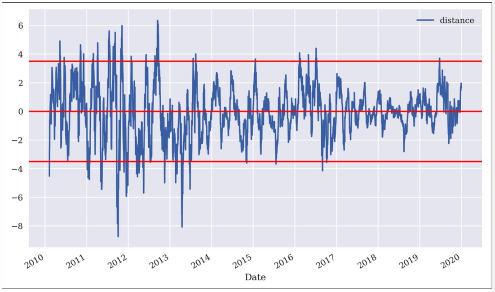
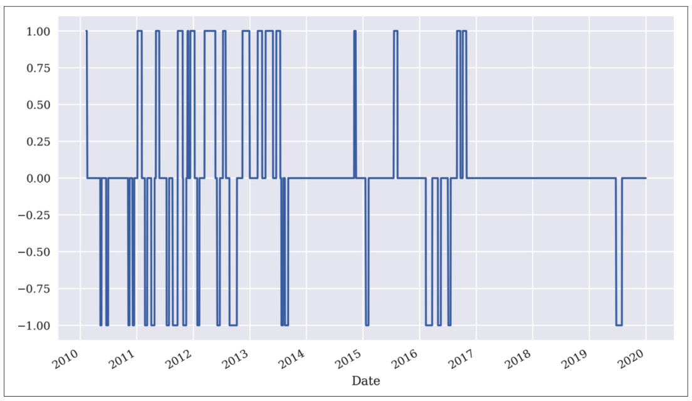

# General idea of strategy
First, you calculate an N day SMA. 

Then, you calculate a `distance` column, defined as the difference between current price with the SMA. 

Finally, you define a `distance_threshold` - if the distance is above the threshold, you should sell. If the distance is below the threshold, you should buy. 

The idea is that whenever price deviates too far away from the 'trend path' (SMA), you're betting that it'll correct itself and revert to mean. 

# Overall implementation pseudo-code 
- `data['SMA'] = data['price'].rolling(SMA).mean()`
- `data['distance'] = data['price'] - data['SMA']`
- `threshold = 3.5`
- `data['position'] = np.where(data['distance'] > threshold,-1, np.nan)` 
    - if distance more than threshold, short; else, NAN
- `data['position'] = np.where(data['distance'] < -threshold,1, data['position'])`
    - if distance less than threshold, long, else, return whatever's in the column
- `data['position'] = data['position'].ffill().fillna(0)` 
    - Forward Fills the NA values as 0; these are the days where you're not taking any position
- Troubleshoot (visualize positions): `data['position'].iloc[SMA:].plot(ylim=[-1.1, 1.1],
figsize=(10, 6));`

- `data['strategy'] = data['position'].shift(1) * data['returns']` - creating strategy returns

# Hyper-params 
- SMA
- threshold
